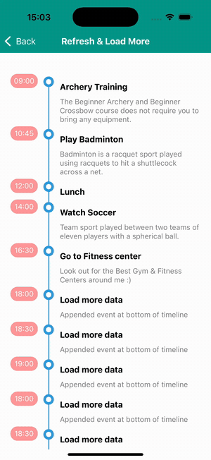

# React Native Timeline Flatlist

[](https://badge.fury.io/js/react-native-timeline-flatlist)
[](http://facebook.github.io/react-native/)

Timeline component for React Native App work for Android and iOS

Written in TypeScript — type definitions are bundled with the package, so no separate `@types` package is needed.

Examples in examples folder

[DEMO HERE](https://snack.expo.io/@eugnis/eaae28)

<p align="center">
  
</p>


**Table of Contents**

- [Installation](#installation)
- [TypeScript support](#typescript-support)
- Usage
  - [Basic usage](#basic-usage)
  - [Custom example](#custom)
  - [Circle dot example](#circle-dot)
  - [Icon example](#icon)
  - [Override render example](#override-render)
  - [Pull to refresh and load more example](#pull-to-refresh-and-load-more)
- Column Format (in v.0.2.0)
  - [Single column right](#single-column-right)
  - [Two column](#two-column)
  - [Time container hiding](#time-container-hiding)
- Configuration
  - [Data Object](#data-object)
  - [Timeline](#timeline)
- Troubleshooting
  - [Shift problem](#shift-problem)
  - [Timeline is rendered, but not displayed until scroll](#timeline-is-rendered-but-not-displayed-until-scroll)

## Installation

```
npm install react-native-timeline-flatlist
```

or

```
yarn add react-native-timeline-flatlist
```

Peer dependencies: `react >= 17.0.0` and `react-native >= 0.64.0`.

## TypeScript support

The library ships with its own type definitions built from the TypeScript source — no `@types/react-native-timeline-flatlist` needed. You can import the types directly:

```tsx
import Timeline, { TimelineProps, Data } from 'react-native-timeline-flatlist'

const data: Data[] = [
  { time: '09:00', title: 'Event 1', description: 'Event 1 Description' },
]
```

## Basic Usage


```jsx
import Timeline from 'react-native-timeline-flatlist'

const data = [
  {time: '09:00', title: 'Event 1', description: 'Event 1 Description'},
  {time: '10:45', title: 'Event 2', description: 'Event 2 Description'},
  {time: '12:00', title: 'Event 3', description: 'Event 3 Description'},
  {time: '14:00', title: 'Event 4', description: 'Event 4 Description'},
  {time: '16:30', title: 'Event 5', description: 'Event 5 Description'}
]

export default function BasicExample() {
  return <Timeline data={data} />
}
```

[see full basic example](https://github.com/Eugnis/react-native-timeline-flatlist/blob/master/examples/Example/app/basic.js)

## Custom


```jsx
export default function CustomExample() {
  return (
    <Timeline
      //..other props
      circleSize={20}
      circleColor='rgb(45,156,219)'
      lineColor='rgb(45,156,219)'
      timeContainerStyle={{minWidth: 52, marginTop: -5}}
      timeStyle={{textAlign: 'center', backgroundColor: '#ff9797', color: 'white', padding: 5, borderRadius: 13}}
      descriptionStyle={{color: 'gray'}}
      options={{
        style: {paddingTop: 5}
      }}
      isUsingFlatlist={true}
    />
  )
}
```

[see full custom example](https://github.com/Eugnis/react-native-timeline-flatlist/blob/master/examples/Example/app/custom.js)

## Circle Dot


```jsx
export default function CircleDotExample() {
  return (
    <Timeline
      //..other props
      innerCircle={'dot'}
    />
  )
}
```

[see full circle dot example](https://github.com/Eugnis/react-native-timeline-flatlist/blob/master/examples/Example/app/dot.js)

## Icon


```jsx
const data = [
  {time: '09:00', title: 'Archery Training', description: 'The Beginner Archery and Beginner Crossbow course does not require you to bring any equipment, since everything you need will be provided for the course. ', lineColor: '#009688', icon: require('../img/archery.png')},
  {time: '10:45', title: 'Play Badminton', description: 'Badminton is a racquet sport played using racquets to hit a shuttlecock across a net.', icon: require('../img/badminton.png')},
  {time: '12:00', title: 'Lunch', icon: require('../img/lunch.png')},
  {time: '14:00', title: 'Watch Soccer', description: 'Team sport played between two teams of eleven players with a spherical ball. ', lineColor: '#009688', icon: require('../img/soccer.png')},
  {time: '16:30', title: 'Go to Fitness center', description: 'Look out for the Best Gym & Fitness Centers around me :)', icon: require('../img/dumbbell.png')}
]

export default function IconExample() {
  return (
    <Timeline
      //..other props
      data={data}
      innerCircle={'icon'}
    />
  )
}
```

Also you can pass any React element as icon or iconDefault:

```jsx
const data = [
  //...
  {time: '12:00', title: 'Custom rendered icon', icon: <Image
    style={{width: 20, height: 20}}
    source={{uri: 'https://reactnative.dev/img/tiny_logo.png'}}
  />},
  //...
]
```

[see full icon example](https://github.com/Eugnis/react-native-timeline-flatlist/blob/master/examples/Example/app/icon.js)

## Override Render


```jsx
const data = [
  {
    time: '09:00',
    title: 'Archery Training',
    description: 'The Beginner Archery and Beginner Crossbow course does not require you to bring any equipment, since everything you need will be provided for the course. ',
    lineColor: '#009688',
    icon: require('../img/archery.png'),
    imageUrl: 'https://cloud.githubusercontent.com/assets/21040043/24240340/c0f96b3a-0fe3-11e7-8964-fe66e4d9be7a.jpg'
  },
  {
    time: '10:45',
    title: 'Play Badminton',
    description: 'Badminton is a racquet sport played using racquets to hit a shuttlecock across a net.',
    icon: require('../img/badminton.png'),
    imageUrl: 'https://cloud.githubusercontent.com/assets/21040043/24240405/0ba41234-0fe4-11e7-919b-c3f88ced349c.jpg'
  },
  {
    time: '12:00',
    title: 'Lunch',
    icon: require('../img/lunch.png'),
  },
  {
    time: '14:00',
    title: 'Watch Soccer',
    description: 'Team sport played between two teams of eleven players with a spherical ball. ',
    lineColor: '#009688',
    icon: require('../img/soccer.png'),
    imageUrl: 'https://cloud.githubusercontent.com/assets/21040043/24240419/1f553dee-0fe4-11e7-8638-6025682232b1.jpg'
  },
  {
    time: '16:30',
    title: 'Go to Fitness center',
    description: 'Look out for the Best Gym & Fitness Centers around me :)',
    icon: require('../img/dumbbell.png'),
    imageUrl: 'https://cloud.githubusercontent.com/assets/21040043/24240422/20d84f6c-0fe4-11e7-8f1d-9dbc594d0cfa.jpg'
  }
]

export default function OverrideRenderExample() {
  const renderDetail = (rowData, rowID) => {
    const title = <Text style={styles.title}>{rowData.title}</Text>
    let desc = null
    if (rowData.description && rowData.imageUrl) {
      desc = (
        <View style={styles.descriptionContainer}>
          <Image source={{uri: rowData.imageUrl}} style={styles.image} />
          <Text style={styles.textDescription}>{rowData.description}</Text>
        </View>
      )
    }

    return (
      <View style={{flex: 1}}>
        {title}
        {desc}
      </View>
    )
  }

  return (
    <Timeline
      //..other props
      data={data}
      renderDetail={renderDetail}
    />
  )
}
```

[see full override render example](https://github.com/Eugnis/react-native-timeline-flatlist/blob/master/examples/Example/app/override.js)

## Pull to refresh and load more


```jsx
export default function RefreshLoadMoreExample() {
  const [data, setData] = useState(initialData)
  const [isRefreshing, setIsRefreshing] = useState(false)
  const [waiting, setWaiting] = useState(false)

  const onRefresh = () => {
    //set initial data
  }

  const onEndReached = () => {
    //fetch next data
  }

  const renderFooter = () => {
    //show loading indicator
    if (waiting) {
      return <ActivityIndicator />
    }
    return <Text>~</Text>
  }

  return (
    <Timeline
      //..other props
      data={data}
      options={{
        refreshControl: (
          <RefreshControl
            refreshing={isRefreshing}
            onRefresh={onRefresh}
          />
        ),
        ListFooterComponent: renderFooter,
        onEndReached: onEndReached
      }}
    />
  )
}
```

[see full refresh and load more example](https://github.com/Eugnis/react-native-timeline-flatlist/blob/master/examples/Example/app/refresh-loadmore.js)

## Column Format

### Single Column Right


```jsx
export default function SingleColumnRightExample() {
  return (
    <Timeline
      //..other props
      columnFormat='single-column-right'
    />
  )
}
```

[see full single column right example](https://github.com/Eugnis/react-native-timeline-flatlist/blob/master/examples/Example/app/single-right.js)

### Two Column


```jsx
export default function TwoColumnExample() {
  return (
    <Timeline
      //..other props
      columnFormat='two-column'
    />
  )
}
```

[see full two column example](https://github.com/Eugnis/react-native-timeline-flatlist/blob/master/examples/Example/app/two-column.js)

### Time container hiding


```jsx
export default function HideTimeExample() {
  return (
    <Timeline
      //..other props
      showTime={false}
    />
  )
}
```

## Configuration

#### Data Object:

| Property            | Type                                    | Default                                | Description                                                       |
| ------------------- | --------------------------------------- | -------------------------------------- | ----------------------------------------------------------------- |
| time                | string                                  | null                                   | event time                                                        |
| title               | string                                  | null                                   | event title                                                       |
| description         | string or React.Element                 | null                                   | event description                                                 |
| lineWidth           | number                                  | same as lineWidth of 'Timeline'        | event line width                                                  |
| lineStyle           | string                                  | same as lineStyle of 'Timeline'        | event line style : 'solid', 'dashed', 'dotted'                    |
| lineColor           | string                                  | same as lineColor of 'Timeline'        | event line color                                                  |
| eventContainerStyle | object                                  | null                                   | custom styles of line                                             |
| circleSize          | number                                  | same as circleSize of 'Timeline'       | event circle size                                                 |
| circleColor         | string                                  | same as circleColor of 'Timeline'      | event circle color                                                |
| dotColor            | string                                  | same as dotColor of 'Timeline'         | event dot color (innerCircle = 'dot')                             |
| icon                | image source, URI string or React.Element | iconDefault                          | event icon (innerCircle = 'icon' or 'element')                    |
| iconDefault         | image source or React.Element           | same as iconDefault of 'Timeline'      | fallback icon for this event (innerCircle = 'icon')               |
| position            | string                                  | null                                   | event side in 'two-column' layout : 'left', 'right'               |
| titleStyle          | object                                  | same as titleStyle of 'Timeline'       | custom styles of this event's title                               |
| descriptionStyle    | object                                  | same as descriptionStyle of 'Timeline' | custom styles of this event's description                         |
| columnSideMargin    | number                                  | same as columnSideMargin of 'Timeline' | custom event line side margin                                     |
| columnSidePadding   | number                                  | same as columnSidePadding of 'Timeline' | custom event line side padding                                   |

#### Timeline:

| Property               | Type                               | Default              | Description                                                      |
| ---------------------- | ---------------------------------- | -------------------- | ---------------------------------------------------------------- |
| data                   | Data[]                             | null                 | timeline data                                                    |
| innerCircle            | string                             | 'none'               | timeline mode : 'none', 'dot', 'icon', 'element'                 |
| separator              | boolean                            | false                | render separator line of events                                  |
| columnFormat           | string                             | 'single-column-left' | can be 'single-column-left', 'single-column-right', 'two-column' |
| lineWidth              | number                             | 2                    | timeline line width                                              |
| lineStyle              | string                             | 'solid'              | timeline line style : 'solid', 'dashed', 'dotted'                |
| lineColor              | string                             | '#007AFF'            | timeline line color                                              |
| circleSize             | number                             | 16                   | timeline circle size                                             |
| circleColor            | string                             | '#007AFF'            | timeline circle color                                            |
| dotColor               | string                             | 'white'              | timeline dot color (innerCircle = 'dot')                         |
| dotSize                | number                             | circleSize / 2       | timeline dot size (innerCircle = 'dot')                          |
| iconDefault            | image source or React.Element      | null                 | default event icon (used when an event has no icon of its own)   |
| style                  | object                             | null                 | custom styles of Timeline container                              |
| circleStyle            | object                             | null                 | custom styles of event circle                                    |
| listViewStyle          | object                             | null                 | custom styles of inner FlatList                                  |
| listViewContainerStyle | object                             | null                 | custom styles of inner FlatList content container                |
| timeStyle              | object                             | null                 | custom styles of event time                                      |
| titleStyle             | object                             | null                 | custom styles of event title                                     |
| descriptionStyle       | object                             | null                 | custom styles of event description                               |
| iconStyle              | object                             | null                 | custom styles of event icon                                      |
| separatorStyle         | object                             | null                 | custom styles of separator                                       |
| rowContainerStyle      | object                             | null                 | custom styles of event container                                 |
| eventContainerStyle    | object                             | null                 | custom styles of the event part of the row (line)                |
| eventDetailStyle       | object                             | null                 | custom styles of the event detail part of the row (line)         |
| timeContainerStyle     | object                             | null                 | custom styles of container of event time                         |
| detailContainerStyle   | object                             | null                 | custom styles of container of event title and event description  |
| onEventPress           | function(event)                    | null                 | function to be invoked when event was pressed                    |
| renderTime             | function(rowData, rowID)           | null                 | custom render event time                                         |
| renderDetail           | function(rowData, rowID)           | null                 | custom render event title and event description                  |
| renderCircle           | function(rowData, rowID)           | null                 | custom render circle                                             |
| renderFullLine         | boolean                            | false                | render event border on last timeline item                        |
| options                | object                             | null                 | FlatList props, passed to the underlying FlatList                |
| showTime               | boolean                            | true                 | Time container options                                           |
| isUsingFlatlist        | boolean                            | true                 | Render inner components in FlatList (if false - render in View)  |
| isAllowFontScaling     | boolean                            | true                 | Allow font scaling on time, title and description text           |
| columnSideMargin       | number                             | 20                   | Custom event line side margin                                    |
| columnSidePadding      | number                             | 20                   | Custom event line side padding                                   |

## Shift problem

Text width of event time may not be the same.


fix by add 'minWidth' in 'timeContainerStyle' to appropriate value

```jsx
export default function ShiftFixExample() {
  return (
    <Timeline
      //..other props
      timeContainerStyle={{minWidth: 72}}
    />
  )
}
```

## Timeline is rendered, but not displayed until scroll

fix by add removeClippedSubviews: false into options

```jsx
export default function RenderFixExample() {
  return (
    <Timeline
      //..other props
      options={{
        removeClippedSubviews: false
      }}
    />
  )
}
```
